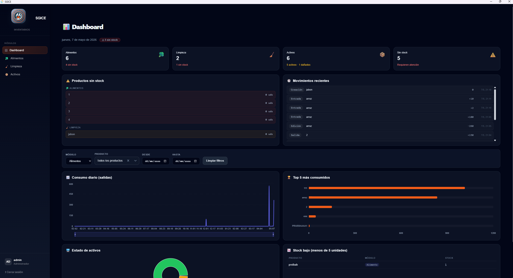
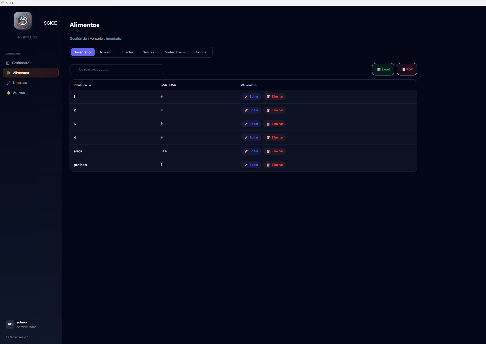
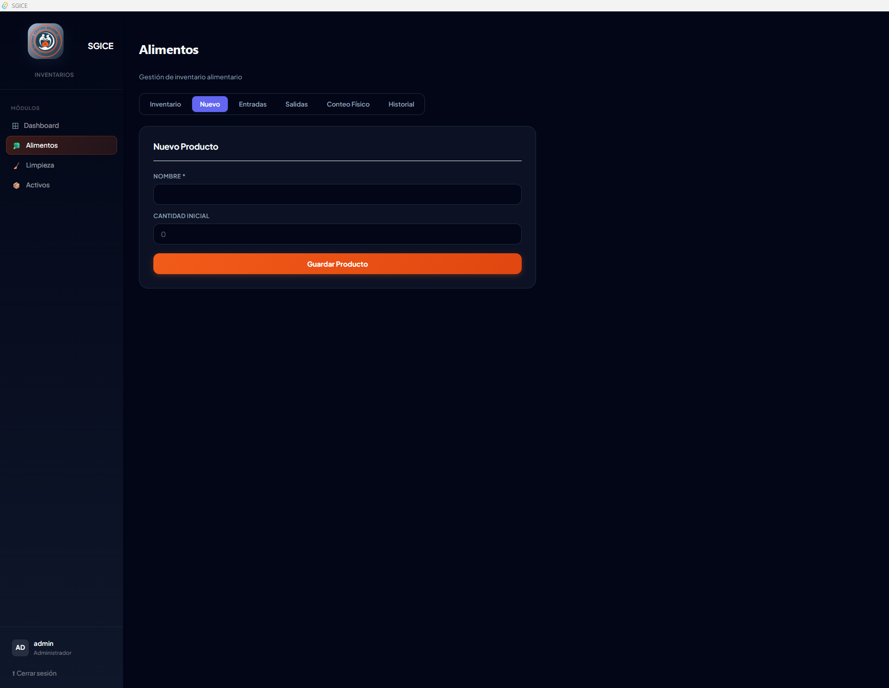
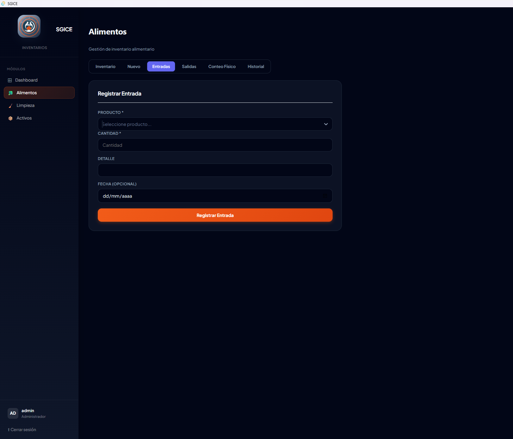
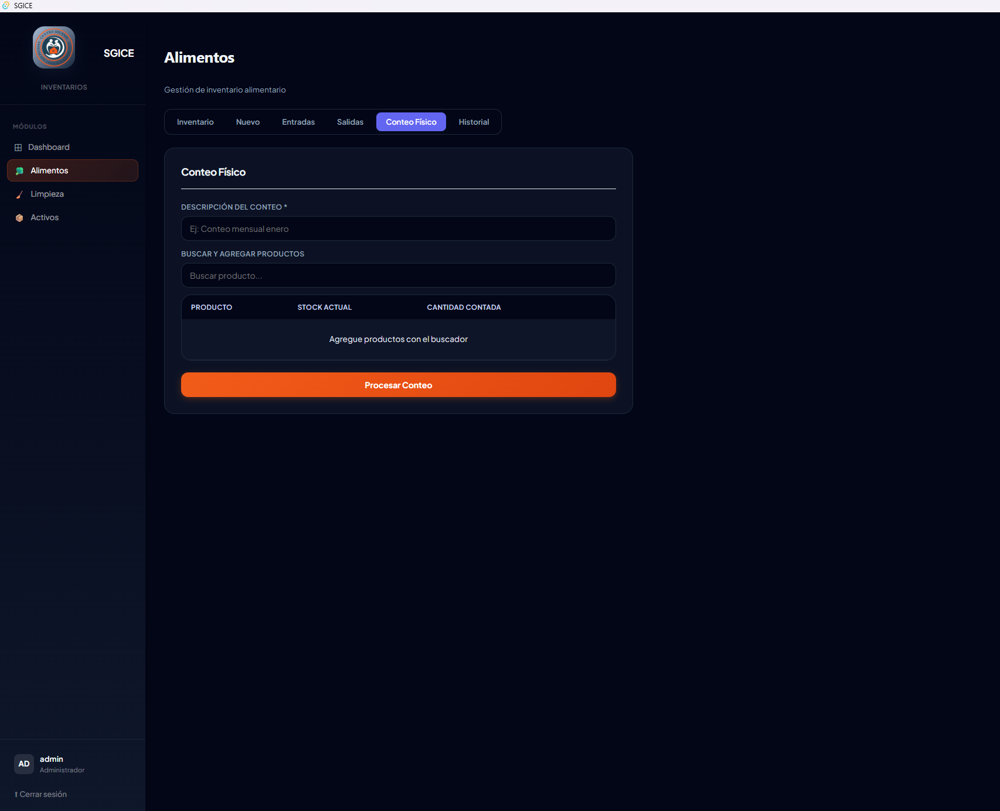
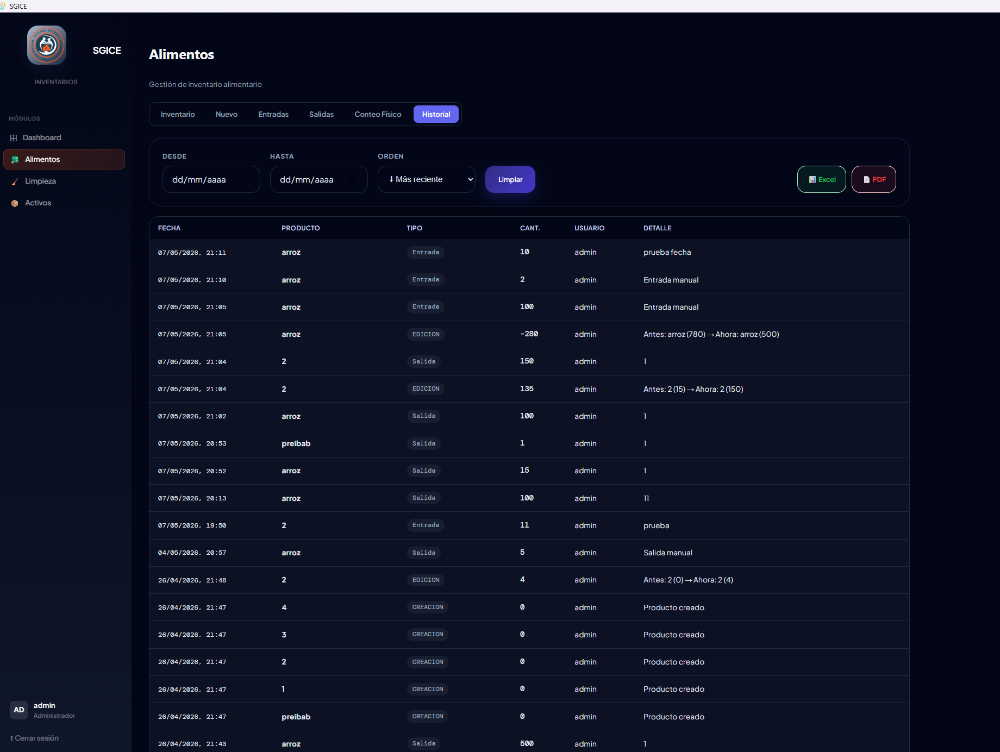
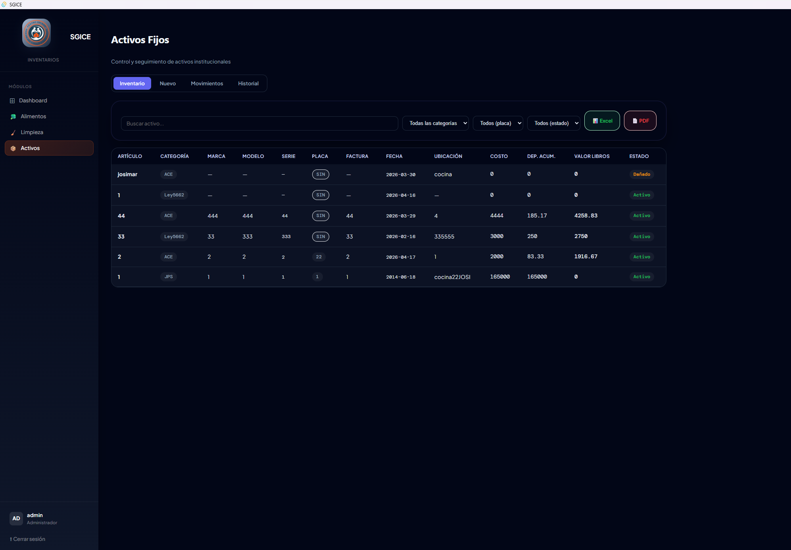
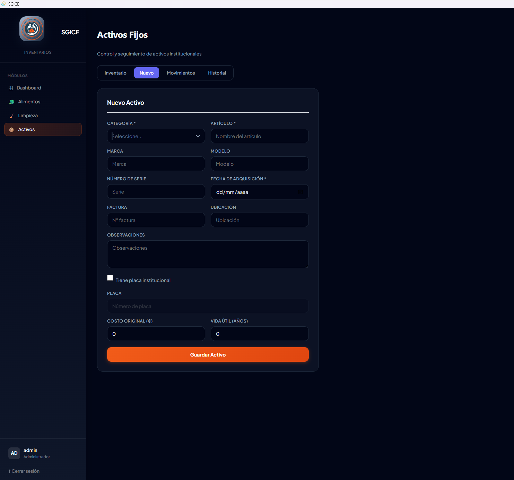
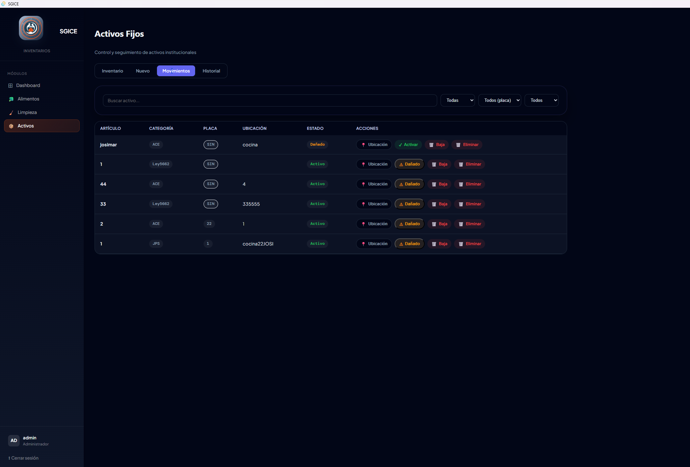
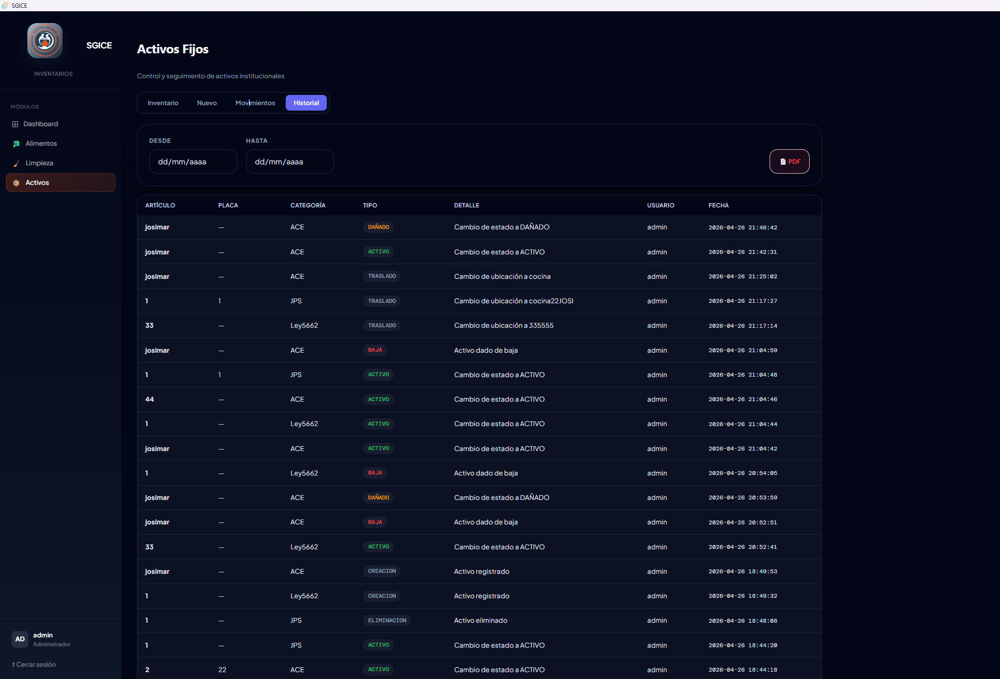

# 📦 SGICE - Inventory and Asset Management System

SGICE is a desktop application developed to improve inventory and asset control processes through a modern and efficient management system.

The application was built using React, Tauri and SQLite, providing a fast desktop experience with interactive dashboards, movement tracking and inventory analytics.

---

## ✨ Features

- Product and inventory management
- Asset management
- Inventory input and output tracking
- Interactive dashboard with charts and statistics
- Low stock alerts
- Inventory movement history
- Date filters and analytics
- PDF and Excel report generation
- Desktop application powered by Tauri

---

## 🛠️ Technologies

- React
- Vite
- JavaScript
- Recharts
- React Select
- Tauri

### Database
- SQLite
Local Database-portable
Ubicated en Documents-BASEINV
---

## 📸 Screenshots

### Dashboard




### Products



---


---


---


---


### Actives












### Users
- admin-1234
- cocina-1234


## 🚀 Installation

Clone the repository:

```bash
git clone https://github.com/JosiVP02/sgice.git


